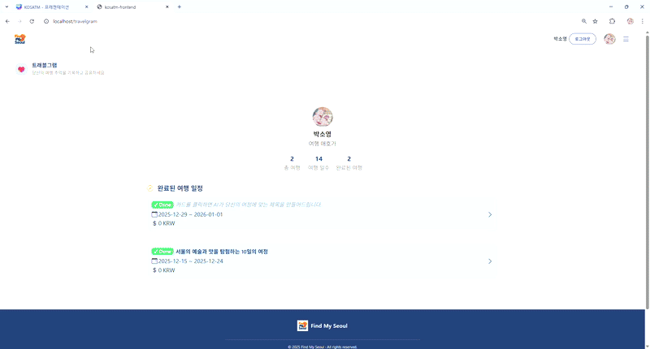
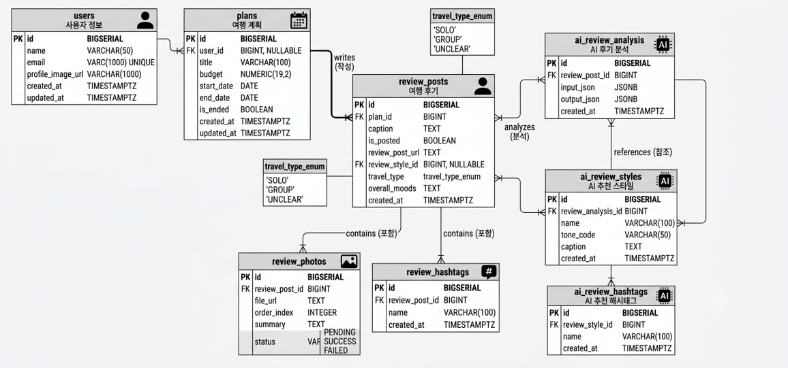

# TripFlow AI

AI Travel Manager 리뷰 생성 기능을 운영 환경을 고려하여 고도화한 프로젝트입니다.

### 주요 개선

- Async 기반 AI 처리
- 상태관리(PENDING/SUCCESS/FAILED)
- DB 구조 개선
- 데이터 중복 방지


## 🖥 실행 화면


## 🗄 ERD


---

## 목차

- [프로젝트 소개](#프로젝트-소개)
- [기술 스택](#기술-스택)
- [고도화 배경](#고도화-배경)
- [작업 내용](#작업-내용)
- [프로젝트 구조](#프로젝트-구조)
- [커밋 컨벤션](#커밋-컨벤션)

---

## 프로젝트 소개

TripFlow AI는 여행을 마친 사용자가 사진과 여행 정보를 바탕으로 SNS 리뷰 초안을 AI로 생성하는 기능을 중심으로 합니다.

팀 프로젝트(AI Travel Manager)에서 저는 Travelgram 리뷰 생성 7단계 플로우 전체를 담당했습니다. 이 개인 프로젝트는 그 흐름을 이어받아, **AI 호출의 신뢰성과 백엔드 구조의 견고함**을 중점적으로 개선합니다.

### 팀 프로젝트에서 담당한 기능 (원본)

- Travelgram 리뷰 생성 7단계 플로우 (프론트 + 백엔드)
- 사진 분석 파이프라인 (사진 → 캡션/해시태그 생성)
- Short Polling 기반 AI 완료 감지
- AWS S3 멀티 파일 업로드
- Naver Search API + Papago 연동

### 이 프로젝트에서 고도화한 부분

- 리뷰 초안 생성 중복 요청 방지 및 AI 실패 처리
- 사진 분석 상태 관리 (무한 폴링 방지, 재분석 API)
- DB 구조 정리 (불필요한 중간 테이블 제거)
- 사진 분석 전용 비동기 스레드풀 분리
- 프론트 리뷰 플로우 composable 리팩터링

---

## 기술 스택

| 분류 | 기술 |
|------|------|
| Frontend | Vue 3, Pinia, Vue Router, Axios, Bootstrap |
| Backend | Java 21, Spring Boot 3.4, Spring AI 1.0, MyBatis |
| Database | PostgreSQL, pgvector |
| Storage | AWS S3 |
| External API | Naver Local Search API |

---

## 고도화 배경

팀 프로젝트 이후 리뷰 생성 흐름에는 아래와 같은 문제가 남아 있었습니다.

**1. 사진 분석이 실패해도 사용자가 알 수 없었다**

사진 분석은 업로드 직후 `@Async`로 실행됩니다. 분석이 실패해도 예외가 외부로 전파되지 않았고, 프론트는 `summary`가 채워지기를 계속 기다렸습니다. 결과적으로 폴링이 끝나지 않아 다음 단계로 진행 자체가 불가능한 상황이 발생했습니다.

**2. 리뷰 초안이 요청할 때마다 새로 생성됐다**

같은 리뷰 페이지를 새로 고침하면 AI를 다시 호출해 초안이 중복 생성됐습니다. 기존 결과가 있어도 재사용하지 않았고, 실패 여부도 기록되지 않았습니다.

**3. DB 구조가 불필요하게 복잡했다**

사진과 해시태그를 묶는 그룹 테이블이 있었지만, 리뷰 하나에 그룹도 항상 하나였습니다. 1:1 관계를 별도 테이블로 쪼개는 구조라 JOIN 비용과 양방향 FK 의존이 생겼습니다.

---

## 작업 내용

### 1. 리뷰 입력 데이터 정비

AI 리뷰 생성의 입력 품질을 높이기 위해 장소 데이터 확보 방식을 정비했습니다.

- Naver Local Search API로 장소 데이터 수집 (기존 demo seed 대체)
- 장소명 + 주소 조합으로 SHA 해싱해 중복 키 생성 → 재실행 시 중복 적재 방지
- `jsonb` 타입으로 AI 입출력(`input_json`, `output_json`), 예약 부가정보, 여행 계획 스냅샷 구조화
- 네이버 API 인증 설정과 import 실행 설정 분리

### 2. DB 구조 평탄화 (review_photo_groups / review_hashtag_groups 제거)

불필요한 중간 테이블을 제거하고 자식 테이블이 `review_post_id`를 직접 참조하도록 변경했습니다.

**변경 전:**
```
review_posts → review_photo_groups → review_photos
review_posts → review_hashtag_groups → review_hashtags
```

**변경 후:**
```
review_posts ← review_photos (review_post_id 직접 참조)
review_posts ← review_hashtags (review_post_id 직접 참조)
```

- 양방향 FK 순환 의존 제거
- 조회 경로 단순화 (2단계 → 1단계)
- `review_post_id` 기준 인덱스 추가

### 3. 사진 분석 상태 관리 도입 (무한 폴링 방지 + 재분석)

**배경:** 분석 실패 시 `summary`가 null로 남아 폴링이 끝나지 않음

**해결:**

- `review_photos.status` 컬럼 추가 (`PENDING` / `SUCCESS` / `FAILED`)
- 분석 agent의 예외를 외부로 전파 → service `catch`에서 `FAILED` 기록
- 유효하지 않은 AI 응답(null, 빈 값, 영어 거절 문구) 감지 후 `FAILED` 처리
- 프론트 폴링 종료 기준을 `summary non-null` → `status가 모두 settled` 로 변경
- `FAILED` 사진은 개별 재분석 API (`POST /reviews/photo/{photoId}/reanalyze`) 호출
- `IllegalStateException → 409`, `IllegalArgumentException → 404` 로 상태별 응답 분리

### 4. 리뷰 초안 생성 흐름 안정화

**배경:** 새로 고침마다 AI 재호출 + 실패 기록 없음

**해결:**

- `AiReviewService.createAndSaveStyles` 진입 시 기존 결과 확인 → 있으면 재사용
- AI 실패 시 상태 기록 및 식별자(`reviewPostId`) 포함 로그
- 원본 예외를 `cause`로 전달해 스택 트레이스 유실 방지
- AI 호출 응답시간 및 token usage 로깅

### 5. 사진 분석 전용 비동기 스레드풀 분리

**배경:** `@Async` 기본 풀 사용 → 큐 용량 무제한, 과부하 시 백프레셔 없음

**해결:**

- `AsyncConfig.java` 추가: 사진 분석 전용 `ThreadPoolTaskExecutor` 빈 등록
- bounded queue + `CallerRunsPolicy`로 과부하 시 거부 정책 명시
- 업로드 시 분석 호출과 재분석 호출 모두 동일 Executor로 통일

### 6. 프론트 리뷰 플로우 리팩터링

- 각 화면(`CreateTravelReview`, `CaptionSelect`, `HashtagSelect` 등)의 API 호출·상태 관리 로직을 composable로 분리
- 페이지 컴포넌트는 조립만 담당하도록 책임 정리
- Vitest + @vue/test-utils 기반 테스트 환경 구성

---

## 프로젝트 구조

```
tripflow-ai/
├── tripflow-ai-backend/          # Spring Boot 백엔드
│   └── src/
│       └── main/java/com/tripflow/ai/
│           ├── travelgram/review/    # 리뷰 도메인 (핵심)
│           └── config/               # AsyncConfig, SecurityConfig 등
├── tripflow-ai-frontend/         # Vue 3 프론트엔드
│   └── src/
│       └── views/travelgram/review/ # 리뷰 생성 플로우 화면
└── docs/                         # 작업 계획 및 분석 문서
    ├── plan/                     # 고도화 계획
    ├── completed/                # 완료된 작업 상세 기록
    ├── templates/                # 작업 기록 템플릿
    └── images/                   # 관련 이미지
```

---

## 커밋 컨벤션

```
type(scope): message
```

| Type | 설명 |
|------|------|
| feat | 기능 추가 |
| fix | 버그 수정 |
| refactor | 코드 구조 개선 |
| docs | 문서 수정 |
| test | 테스트 추가 또는 수정 |
| chore | 설정, 빌드, 기타 작업 |

| Scope | 설명 |
|-------|------|
| back | 백엔드 |
| front | 프론트엔드 |
| docs | 문서 |
